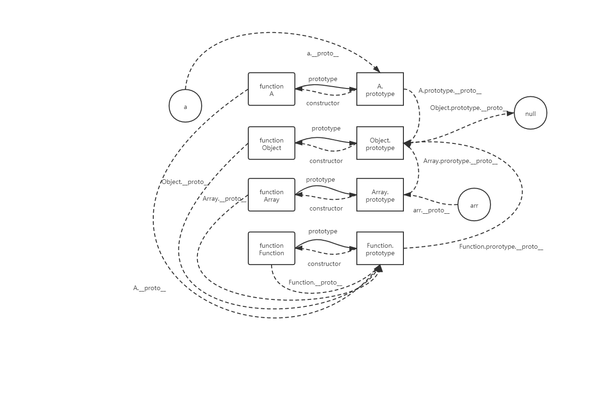

<a name="SSW9o"></a>

# 数据基础结构

<a name="HGKSr"></a>

##### JavaScript 数据类型

```javascript
值类型(基本类型)：
字符串（String）、数字(Number)、布尔(Boolean)、对空（Null）、未定义（Undefined）。
引用数据类型：
    对象(Object)、数组(Array)、函数(Function)。
```

<a name="Jsz4o"></a>

##### JavaScript 数据类型转换

```javascript
Number()        + 一元加
将一个string解析成number类型  如果无法解析则返回NaN；
(Object)转换为数值：任意对象转换成数字的结果都是NaN;
parseFloat()
用法：a = parseFloat(a)
将一个字符串解析出浮点数据(带有小数的数值)
如果没有可解析的部分则返回NaN
parseInt()
用法：a = parseInt(a)
将一个字符串解析出整数部分的数据
如果没有可解析的部分 则返回NaN

转化为字符串：任意对象转化为字符串都是[object Object]；null NaN undefined true false 转换成字符串类型，都是原样转换；
当+号被看做是字符连接符时，另外一边不是字符串类型的数据会被自动转换成字符串类型，然后进行连接
toString()     使用连接符连接空字符串  data + ''
JS中除了 null 和 undefined 以外 都有toString函数
toString函数操作number类型时可以转换进制数
var num = 17;
console.log(num.toString(2));   //转化为二进制
toFixed():保留几位小数;

转化为布尔值：
Boolean()        ！！逻辑非
         将操作的值转成布尔值
```

<a name="RIQmy"></a>

# 函数

<a name="oybYL"></a>

##### 函数的创建

```javascript
函数的申明：(小括号里面的称为形参)
function name(参数1,参数2){
  语句；
} ；

表达式创建（赋值创建）（先申明，后使用）：
var myFun = function {
    语句；
}；
```

<a name="VN0vz"></a>

##### if-else 语句

```javascript
if(){ }
else{ }
```

<a name="o8ccs"></a>

##### switch 语句

```javascript
swich在不碰到break的时候发生穿透执行进行累加
switch(index){
    case(1):      ;
    case(2):      ;
    case(3):      ;
    break;    //终止循环
    default;  //默认值,找不到匹配项输出的结果
}
break语句：跳出当前循环（最近的），后面代码将不执行
continue语句：跳过本次循环进入下一次循环
```

<a name="zMuQu"></a>

##### while 循环

```javascript
while(){ }
```

<a name="jW9Sy"></a>

##### do-while 循环

```javascript
do{ }
while();   //满足条件循环
```

<a name="Rdy53"></a>

##### for 循环

```javascript
for(表达式1；表达式2；表达式3){
    循环语句
}
表达式 2多条件，以最后一个条件为准；
```

<a name="KiZZa"></a>

##### arguments 对象

```javascript
保存了调用函数传入的实参；类数组；为每个参数提供了索引；
用[]进行索引：arguments[1]
length:表示长度，参数个数；
callee：返回当前函数的引用；
return：函数的返回值，默认为undefined；可以出现多次，但是只执行一次；接收时将函数整体赋值给一个变量;
```

<a name="lJ8B8"></a>

##### 递归函数

```javascript
function fn(){
    if(){
        return   ;
    }
    else{
        return fn();
    }
}
```

<a name="vKz9y"></a>

##### 匿名函数：定义函数时未给函数命名

```javascript
优点：
1、有效隔绝作用域，避免作用域污染
2、仅在执行时创建作用域链对象
两种使用方式：
1、自执行函数（自调用函数、一次性函数）：
(function(形参){})(实参);
!function(){}();
~function(){}();
2、回调函数（将一个匿名函数作为参数使用）：
function fn (){
    callback();
}
fn(function(){});
```

<a name="gtnre"></a>

##### 计时器

```javascript
setInterval(callback,delay)：会在每次时间间隔为delay时执行一次callback；返回值是id（计时器编号）；
                      delay:延迟时间 ms
          clearInterval(name):清除计时器
 var timer = setInterval(function () {
  console.log('1')
}, 2000)
```

```javascript
setTimeout(callback,delay):只执行一次函数；返回值是id（计时器编号）；
                     delay:延迟时间 ms
```

<a name="RfQB6"></a>

# 原型、原型链

<a name="CLsnA"></a>

##### 封装、继承、多态

```javascript
封装：通俗的来说就是封装函数，通过私有化的变量和私有化的方法，不让外部访问到
继承：简约来说可分为两种：
1).通过原型prototype对象实例化实现此类的继承；
2).直接实例化对象复制，完全复制父类对象
多态： 多态就是通过对传递的参数判断来执行逻辑，即可实现一种多态处理机制
```

<a name="NaqlH"></a>

##### 构造函数去继承对象

```javascript
用new去调用，指向内存地址；
可以用this新建属性、属性值，为私有属性；
function Preson (x,y,z){
    this.x = x;
    this.y = y;
    this.z = z;
}
let person = new Preson();
```

<a name="Rp79D"></a>

##### new 的过程中主要做了如下操作：

```javascript
1、创建一个新对象：
	let obj = new Object()
2、设置原型链：
	obj.__proto__ = a.prototype
3、改变this指向：
	let res = a.call(obj)
4、判断返回值类型：// 普通函数返回值默认为undefind 构造函数默认返回新创建的对象
	person = typeof (res) === 'object'?res:obj
```

原型链：<br />

<a name="fC6v7"></a>

##### 原型对象 prototype

```javascript
公有属性，指向同一个内存地址；
可以被所以实例对象访问；
对象优先查找自身私有属性；
每个对象都拥有一个指针（__proto__），固定指向该对象构造函数的原型对象；
```

<a name="u1t3u"></a>

##### 定义、修改属性

```javascript
Object.defineProperty(obj,prop,descriptor):修改或定义一个对象的属性值；返回次=此对象；
    obj:需要定义或修改属性的对象；
    prop：需要修改的属性（字符串型）；
    descriptor：描述属性，修改后默认不可修改 （writable : true //可修改）、
                            默认不可枚举 （enumerable：true // 可枚举）、
                            默认不可被删除（configurable : true //可删除）；
```

<a name="OPU1e"></a>

##### class 关键字

```javascript
构造函数的语法糖；本质是函数；
class Student{
    //定义构造函数
    constructor(name,sex,age){             //实例化时立即调用
        //私有属性
        this.name = name;
        this.sex = sex;
        this.age = age;
    }
    //公有函数
    nihao(){
        ...
    }
    //static 静态的、关键字，用来定义静态函数或静态属性；
    static getClassName(){
        ...
    }   //调用与实例无关，用类名访问-Student.getClassName;
}
let s1 = new Student('..','..',..);
```

<a name="RC97P"></a>

##### 基于 class 继承

```javascript
extends：关键字，用于继承父类；
class son extends father{     //继承父类私有属性，super前不允许有任何属性；
     constructor(name){
         super(name);       //函数，调用父类属性；在调用 super()方法之前，子类构造函数无法使用this引用
     }
}
```

<a name="EphqA"></a>

# this 指向和闭包

<a name="ZjJUz"></a>

##### 修改 this 指向

```javascript
//call和apply都可以用于修改函数中的this指向；他们的区别在于参数的传递
1、call 用于立即调用函数 并修改函数中的this指向；函数的参数按原有顺序依次传入
  	fn.call({});
2、apply 用于立即调用函数 并修改函数中的this指向；函数的参数 是apply第二个参数(数组或类数组)，数组或类数组对象会自动展开成为函数的参数
  	fn.apply([]);
3、function.prorotype.bind(thisObj，arg):修改this指向为thisObj，并为函数绑定实参；返回一个新函数，需要手动执行；
    参数：thisObj：函数中this指向的对象； arg：实参；
 		fn.bind(obj,arg);
//apply和call方法在使用时，会改变this指向然后传参后立即执行函数，返回结果
//bind方法是创建了一个新的函数，在这个被创建的新的函数中，this的指向被改变，并接收了bind传递的参数。需要另外手动调用后，函数才会被执行。
```

<a name="axIKu"></a>

##### 闭包

```javascript
从语法结构来说 闭包是一种JS特有的函数嵌套结构
具体的表现行为 在一个较大的作用域内访问一个较小作用域中的变量

行成闭包的三个必要条件：
1. 函数嵌套(至少有两个函数)
2. 内层函数中使用了外层函数的变量或参数
3. 内层函数被返回到外部在外部使用

闭包的作用：
1. 保护具有共享意义的变量
2. 隔离作用域 避免作用域污染
3. 为变量提供对外访问接口

闭包的缺点：
1. 概念复杂 不易理解
2. 占用过多资源(内存) 大量使用不利于代码优化

内层函数引用了外层函数的变量(参数) 导致垃圾回收机制没有销毁变量 行成新的闭包作用域；
闭包作用域中的值 不会随垃圾回收机制销毁；销毁闭包的方式是将闭包的函数赋值为null

实例：
let fn = (function () {
    let a = 10;
    return fn2;
    function fn2() {
        a++;
        console.log(a);
    }
})();
fn();
```

<a name="tzCNy"></a>

##### 防抖和节流

```javascript
// 给高频事件降频
1. 函数防抖
 // 核心思想 事件结束后等待N秒，执行函数；如果在N这个时间范围内 多次触发事件 则从新计时
 实例：
 function debounce(callback, delay) {
    let timer = null; // 用于存放计时器id

    return function () {
        let arg = arguments; // 保存实参

        if (timer) { // 之前如果有开启过计时器(之前有任务)
            clearTimeout(timer); // 关闭计时器
        }

        timer = setTimeout(() => { // 到达时间
            callback.apply(this, arg); // 执行任务
        }, delay);
    }
}

2. 函数节流
 // 核心思想 每隔N秒执行函数；想要知道间隔时间 就需要记录上一次的执行时间
 实例：
function thottle(callback, wait) {
    let prev = 0; // 用于记录上次函数的执行时间

    return function () {
        let now = Date.now(); // 获得当前时间

        if (now - prev >= wait) { // 当当前时间-上次执行时间 大于等于 等待时间  说明到点了
            callback.apply(this, arguments); // 执行回调函数
            prev = now; // 更新上一次的执行时间
        }
    }
}
```

<a name="phcHi"></a>

# 异步机制-事件轮询

**微任务队列：Promise.then、Object.observe、MutationObserver、process.nextTick(Node.js 环境)；**<br />**宏任务队列：script(整体代码)、setTimeout、setInterval、I/O、UI 交互事件、postMessage、MessageChannel、setImmediate(Node.js 环境)；**

```javascript
console.log(1);
setTimeout(function () {
  console.log(6);
}, 1000);
new Promise(function (resolve, reject) {
  console.log(2);
  setTimeout(function () {
    console.log(3);
  }, 500);
  resolve();
}).then(function (res) {
  console.log(4);
});
console.log(5);

// 输出结果 1 2 5 4 3 6
// 解析：promise是同步任务，promise.then才是微任务，遇到定时器压入宏任务，遇到.then压入微任务  执行顺序：整体 -> 微任务 -> 宏任务 -> 微任务 -> 宏任务
```

<a name="VN8j0"></a>

# JavaScript 内置对象

<a name="wLOA6"></a>

## BOM&DOM 对象

<a name="xVSuf"></a>

### BOM 模型

```javascript
window对象是BOM的根对象，其它对象都是window对象的属性；浏览器环境全局对象，表示一个标签页（窗口）；
在全局作用下，this关键字指向window；所有子对象或子属性都可以省略'window.'；
var 声明的对象，都是window的子属性；
function 声明的全局函数，也是window的子属性；
```

```javascript
location.href:用于获得或设置路径值；
location.hash：用于获得或设置锚点值（url从#开始的部分）；
location.host：用于获得或设置主机名和端口号；
location.pathname：用于获得或设置路径名；
location.port：用于获得或设置端口号；
location.protocol:用于获得协议；
location.search：用于获得地址栏中从？开始的部分；

改变地址的锚点值；
window.onhashchange = function(){}  //捕捉锚点改变
```

<a name="mDrMY"></a>

### DOM 模型

| 方法                     | 描述                                                            |
| ------------------------ | --------------------------------------------------------------- |
| getElementById()         | 返回带有指定 ID 的元素。                                        |
| getElementsByTagName()   | 返回包含带有指定标签名称的所有元素的节点列表（集合/节点数组）。 |
| getElementsByClassName() | 返回包含带有指定类名的所有元素的节点列表。                      |
| appendChild()            | 把新的子节点添加到指定节点。                                    |
| removeChild()            | 删除子节点。                                                    |
| replaceChild()           | 替换子节点。                                                    |
| insertBefore()           | 在指定的子节点前面插入新的子节点。                              |
| createAttribute()        | 创建属性节点。                                                  |
| createElement()          | 创建元素节点。                                                  |
| createTextNode()         | 创建文本节点。                                                  |
| getAttribute()           | 返回指定的属性值。                                              |
| setAttribute()           | 把指定属性设置或修改为指定的值。                                |

<a name="SmPz1"></a>

### 节点和元素操作

```javascript
html文件的根节点为html，获取方式为document.documentElement；
childNodes：获取所有子节点（包含空文本换行）；类数组对象（不是数组），获取一个元素的所有子节点；元素有序排列，可以通过做引访问；
children：所有子元素；
parentNode：获得一个元素节点的父节点；最高级别节点是document；
parentElement：父元素；
firstChild：第一个子节点；
firstElementChild：第一个子元素；
lastChild：最后一个子节点；
lastElementChild：最后一个子元素；
```

```javascript
previousSibling：获得上一个兄弟节点；
previousElementSibling：上一个兄弟元素；
nextSibling：下一个兄弟节点；
nextElementSibling：下一个兄弟元素；
```

```javascript
节点名：
nodeName：返回一个string类型的值，只读属性（不能赋值）；

节点值：
nodeValue：（节点的内容）

节点类型：
nodeType：number类型值；
```

```javascript
innerHTML：获得/设置对象内全部的HTML代码，字符串类型
textContent：获得或设置元素的文本内容，不能识别标签；
```

<a name="iF6TO"></a>

### 属性集合 attribute

通过元素的 attributes 可以获得属性集合；属性集合是一个类数组；<br />可以通过索引或属性名获得元素对应的属性节点；

```javascript
1、a.attributes[index].value;
2、a.attributes['属性名'].value;
3、a.getAttributeNode('属性名').value;
4、a.getAttribute('属性名');     //常用法
```

```javascript
1、a.attributes['属性名'].nodeValue = value;
2、a.setAttributeNode();
3、a.setAttributeNode('name','value');   //可以新增，常用法
```

```javascript
1、a.removeAttributeNode();
2、a.removeAttribute('属性名')；
```

```javascript
操作数组方法增删改
HTML5新增：classList
a.classList.add('');
a.classList.remove('');
a.classList.replace('','');    //修改
a.classList.toggle('');        //切换类名
```

```javascript
document.getElementById():通过id选择元素；
document（node）.getElementsByTagName():通过元素名选择元素集合，集合是类数组对象；
document.getElementsByName():通过name属性选择元素（一般情况用来选择表单-radio/checkbox--checked属性），选择结果是类数组对象；
document（node）.getElementsByClassName():通过类名选择元素，结果是类数组对象；
document.documentElement():选择整个HTML；
document.querySelector():通过css选择器选择第一个匹配的元素，结果是一个元素节点；
document.querySelectorAll():通过css选择器选择所有匹配的元素，结果是一个类数组对象；
```

```javascript
创建元素：document.createElement('标签名')；
在结尾追加节点：parentNode.appendChild(childNode);
在指定父节点的某个子节点之前插入节点：parentNode.insertBefore(newChild,existingChild);
```

```javascript
1、parentNode.removeChlid(childNode);    //返回被删除的元素
2、DOM.remove();          //没有返回值
   li.remove();
```

```javascript
parentNode.replaceChild(newNode, oldNode);
```

<a name="VUMrN"></a>

### 自定义属性

```javascript
HTML5新增，方便保存和操作数据；
语法要求：
所有自定义属性要求 data-  前缀；属性为dataset;
语法：box.dataset;
     box.dataset.name/id/index;
     box.dataset.name/id/index = '';
删除：delete box.dataset.name/id/index;

设置css：
<style>
    div[data-class]{
        width: 100px;
        height: 100px;
        background: #8959a8;
        border: 1px solid #cccccc;
    }
    div[data-class="my"]{
        box-shadow: 0 0 5px 5px #CCCCCC;
    }
</style>
<div id="div1" data-class = "myClass"></div>
<div id="div2" data-class = "my" ></div>

1.如何设置
        通过JavaScript内置的setAttribute('data属性名','新内容')即可设置
        通过该数据类型的 dataset 方法设置data值，IE10以上才支持；
            var button = document.queryselector('button')
            button.dataset.data属性名 = '新内容' ; 这里的data属性名是指data-后面的名字

2.如何获取
        通过JavaScript内置的getAttribute('data属性名') 即可获取
        通过该数据类型的 dataset 方法设置data值，IE10以上才支持；
            var button = document.queryselector('button')
            data = button.dataset.data属性名 ; 这里的data属性名是指data-后面的名字
```

<a name="sJ2Ua"></a>

### DOM 事件

| **一般事件**           |                                                                                            |
| ---------------------- | ------------------------------------------------------------------------------------------ |
| **事件**               | **描述**                                                                                   |
| **onclick**            | 鼠标点击事件，多用在某个对象控制的范围内的鼠标点击                                         |
| **onDblClick**         | 鼠标双击事件                                                                               |
| **onMouseDown**        | 鼠标上的按钮被按下了                                                                       |
| **onMouseUp**          | 鼠标按下后，松开时激发的事件                                                               |
| **onMouseMove**        | 鼠标移动时触发的事件                                                                       |
| **onContextMenu**      |                                                                                            |
| **onMouseOver**        | 当鼠标移动到某对象范围的上方时触发的事件                                                   |
| **onMouseOut**         | 当鼠标离开某对象范围时触发的事件                                                           |
| **onKeyPress**         | 当键盘上的某个键被按下并且释放时触发的事件.[注意:页面内必须有被聚焦的对象]                 |
| **onKeyDown**          | 当键盘上某个按键被按下时触发的事件[注意:页面内必须有被聚焦的对象]                          |
| **onKeyUp**            | 当键盘上某个按键被按放开时触发的事件[注意:页面内必须有被聚焦的对象]                        |
| **页面相关事件**       |                                                                                            |
| **事件**               | **描述**                                                                                   |
| **onAbort**            | 图片在下载时被用户中断                                                                     |
| **onBeforeUnload**     | 当前页面的内容将要被改变时触发的事件                                                       |
| **onError**            | 捕抓当前页面因为某种原因而出现的错误，如脚本错误与外部数据引用的错误                       |
| **onLoad**             | 页面内空完成传送到浏览器时触发的事件，包括外部文件引入完成                                 |
| **onMove**             | 浏览器的窗口被移动时触发的事件                                                             |
| **onResize**           | 当浏览器的窗口大小被改变时触发的事件                                                       |
| **onScroll**           | 浏览器的滚动条位置发生变化时触发的事件                                                     |
| **onStop**             | 浏览器的停止按钮被按下时触发的事件或者正在下载的文件被中断                                 |
| **onUnload**           | 当前页面将被改变时触发的事件                                                               |
| **表单相关事件**       |                                                                                            |
| **事件**               | **描述**                                                                                   |
| **onBlur**             | 当前元素失去焦点时触发的事件 [鼠标与键盘的触发均可]                                        |
| **onChange**           | 当前元素失去焦点并且元素的内容发生改变而触发的事件 [鼠标与键盘的触发均可](多选框）         |
| **onFocus**            | 当某个元素获得焦点时触发的事件                                                             |
| **onReset**            | 当表单中 RESET 的属性被激发时触发的事件                                                    |
| **onSubmit**           | 一个表单被递交时触发的事件                                                                 |
| **滚动字幕事件**       |                                                                                            |
| **事件**               | **描述**                                                                                   |
| **onBounce**           | 在 Marquee 内的内容移动至 Marquee 显示范围之外时触发的事件                                 |
| **onFinish**           | 当 Marquee 元素完成需要显示的内容后触发的事件                                              |
| **onStart**            | 当 Marquee 元素开始显示内容时触发的事件                                                    |
| **编辑事件**           |                                                                                            |
| **事件**               | **描述**                                                                                   |
| **onBeforeCopy**       | 当页面当前的被选择内容将要复制到浏览者系统的剪贴板前触发的事件                             |
| **onBeforeCut**        | 当页面中的一部分或者全部的内容将被移离当前页面[剪贴]并移动到浏览者的系统剪贴板时触发的事件 |
| **onBeforeEditFocus**  | 当前元素将要进入编辑状态                                                                   |
| **onBeforePaste**      | 内容将要从浏览者的系统剪贴板传送[粘贴]到页面中时触发的事件                                 |
| **onBeforeUpdate**     | 当浏览者粘贴系统剪贴板中的内容时通知目标对象                                               |
| **onCopy**             | 当页面当前的被选择内容被复制后触发的事件                                                   |
| **onCut**              | 当页面当前的被选择内容被剪切时触发的事件                                                   |
| **onDrag**             | 当某个对象被拖动时触发的事件 [活动事件]                                                    |
| **onDragDrop**         | 一个外部对象被鼠标拖进当前窗口或者帧                                                       |
| **onDragEnd**          | 当鼠标拖动结束时触发的事件，即鼠标的按钮被释放了                                           |
| **onDragEnter**        | 当对象被鼠标拖动的对象进入其容器范围内时触发的事件                                         |
| **onDragLeave**        | 当对象被鼠标拖动的对象离开其容器范围内时触发的事件                                         |
| **onDragOver**         | 当某被拖动的对象在另一对象容器范围内拖动时触发的事件 [活动事件]                            |
| **onDragStart**        | 当某对象将被拖动时触发的事件                                                               |
| **onDrop**             | 在一个拖动过程中，释放鼠标键时触发的事件                                                   |
| **onLoseCapture**      | 当元素失去鼠标移动所形成的选择焦点时触发的事件                                             |
| **onPaste**            | 当内容被粘贴时触发的事件                                                                   |
| **onSelect**           | 当文本内容被选择时的事件                                                                   |
| **onSelectStart**      | 当文本内容选择将开始发生时触发的事件                                                       |
| **数据绑定**           |                                                                                            |
| **事件**               | **描述**                                                                                   |
| **onAfterUpdate**      | 当数据完成由数据源到对象的传送时触发的事件                                                 |
| **onCellChange**       | 当数据来源发生变化时                                                                       |
| **onDataAvailable**    | 当数据接收完成时触发事件                                                                   |
| **onDatasetChanged**   | 数据在数据源发生变化时触发的事件                                                           |
| **onDatasetComplete**  | 当来子数据源的全部有效数据读取完毕时触发的事件                                             |
| **onErrorUpdate**      | 当使用 onBeforeUpdate 事件触发取消了数据传送时，代替 onAfterUpdate 事件                    |
| **onRowEnter**         | 当前数据源的数据发生变化并且有新的有效数据时触发的事件                                     |
| **onRowExit**          | 当前数据源的数据将要发生变化时触发的事件                                                   |
| **onRowsDelete**       | 当前数据记录将被删除时触发的事件                                                           |
| **onRowsInserted**     | 当前数据源将要插入新数据记录时触发的事件                                                   |
| **外部事件**           |                                                                                            |
| **事件**               | **描述**                                                                                   |
| **onAfterPrint**       | 当文档被打印后触发的事件                                                                   |
| **onBeforePrint**      | 当文档即将打印时触发的事件                                                                 |
| **onFilterChange**     | 当某个对象的滤镜效果发生变化时触发的事件                                                   |
| **onHelp**             | 当浏览者按下 F1 或者浏览器的帮助选择时触发的事件                                           |
| **onPropertyChange**   | 当对象的属性之一发生变化时触发的事件                                                       |
| **onReadyStateChange** | 当对象的初始化属性值发生变化时触发                                                         |

```javascript
window.onscroll:窗口滚动条事件；
window.onresize:窗口大小改变事件；
window.onscroll = window.onresize = function(){}   //同时触发；
距离定位父元素的竖直距离：document.documentElemt.scrollTop;
react获取点击元素的左边距：e.currentTarget.offsetLeft
距离滚动元素的可视范围距离： document.getElementById(index).offsetTop - document.getElementById(index).parentElement.scrollTop
```

```javascript
1.offsetTop 当前对象到其上级层顶部的距离。

2.offsetLeft 当前对象到其上级层左边的距离。

3.offsetWidth
  当前对象的宽度。(包括边线的宽) 与style.width属性的区别在于:

  1)如对象的宽度设定值为百分比宽度,则无论页面变大还是变小,style.width都返回此百分比。

  2)而offsetWidth则返回在不同页面中对象的宽度值而不是百分比值

4.offsetHeight
	当前对象的高度。(包括边线的高)

  1）与style.height属性的区别在于:如对象的宽度设定值为百分比高度,则无论页面变大还是变小,style.height都返回此百分比

  2）而offsetHeight则返回在不同页面中对象的高度值而不是百分比值

5.clientWidth 是对象可见的宽度，不包滚动条等边线，会随窗口的显示大小改变。

6.clientHieght 网页可见区域高（clientHieght+scrollTop > offsetTop => 元素可见）

7.scrollLeft 对象的最左边到对象在当前窗口显示的范围内的左边的距离，即是在出现了横向滚动条的情况下，滚动条拉动的距离。

8.scrollTop 对象的最顶部到对象在当前窗口显示的范围内的顶边的距离，即是在出现了纵向滚动条的情况下，滚动条拉动的距离。

9.window.screenTop 网页正文部分上

10.window.screenLeft 网页正文部分左

11.window.screen.height 屏幕分辨率的高

12.window.screen.width 屏幕分辨率的宽

13.window.screen.availHeight 屏幕可用工作区高度
```

```javascript
1、HTML事件处理：直接添加到html结构中； ，
2、DOM 0级事件处理：事件绑定，将一个事件处理函数赋值给一个元素的事件处理属性；只能为元素绑定一个事件处理函数；（将事件处理属性赋值为null就可以解绑）
    document.getElementById("btn").onclick = function（）{ alert("hello"); } //脚本里面绑定
3、DOM 2级事件处理：事件监听，
    node.addEventListener(eventType,callback,bool=false):
    eventType(事件类型)：click,input.....（没有on)
    callback：事件监听函数
    boll：默认值false  冒泡（false）/捕获（true)
    事件监听允许一个元素添加多个事件处理函数；与添加顺序有关；
    事件移除：
    node.removeEventListener(eventType,fnname/arguments.callee);    //arguments.callee当前函数引用
4、IE事件处理：attachEvent(eventType,callback);
   IE事件移除：detachEvent(eventType,callback);
   eventType(事件类型)：click,input.....（有on)
```

```javascript
在DOM标准中，事件处理周期分三个阶段：
1、事件捕获  从最不具体的事物到最具体的事物，事件沿DOM树向下传播
2、目标触发  运行事件监听函数
3、事件冒泡  从最具体的事物到最不具体的事物，事件沿DOM树向上传播
DOM 0 只能使用事件冒泡，低版本IE只有冒泡；
DOM 2级事件处理：事件监听，
    node.addEventListener(eventType,callback,bool=false):
    eventType(事件类型)：click,input.....（没有on)
    callback：事件监听函数a
    boll：默认值false  事件冒泡（false）/ 事件捕获（true)
```

```javascript
IE8以下event不属于DOM，属于BOM，使用event时需要写全称；

DOM标准方法阻止事件捕获/冒泡（react可用）：event.stopPropagation()；
IE中阻止事件捕获/冒泡：event.canceBubble = true;
```

```javascript
阻止默认事件（react可用）：event.preventDefault();  - event.returnValue = false;  //兼容IE
```

```javascript
将事件处理函数添加给事件目标的祖先元素；
通过事件冒泡的特性，判断事件的源，为目标添加事件；
每个事件处理函数都有一个event对象用于描述事件信息；
在event对象中，有一个target / srcElement属性指向事件目标；
示例：
box.onclick = function (event) {
    event = event || window.event;
    // console.log(event.target); // 标准
    // console.log(event.srcElement); // IE
    var target = event.target || event.srcElement; // 兼容
    if (target.nodeName === 'BUTTON') {
        box.innerHTML += '<button>按钮</button>';
    }
}
```

```javascript
type:事件类型；-contextmenu(鼠标右键点击)
button：鼠标按键编号；
鼠标事件对象属性：
clientX \clientY :根据浏览器可视区域左上角计算坐标；
pageX \ pageY :根据页面左上角计算坐标；
layerX \ layerY ：根据页面左上角计算坐标；
offsetX \ offsetY :根据（父）元素左上角计算点击坐标；
screenX \ screenY ：根据屏幕左上角计算点击坐标；
```

```javascript
keydown-按下（返回最后一个输入值）
keycode/which:键盘按键编码（回车13、空格32、ctrl7、数字48-57、字母65-90）；
altkey/shiftkey/ctrlkey:返回布尔值，表示是否同时按下；
input：获得用户输入内容；（动态显示输入值，每次变化都可以输出前面的全部）
```

```javascript
wheelDelta：判断鼠标滚轮方向，+向上，-向下    ||   / detail:火狐判断鼠标滚轮方向，+向下，-向上；
```

<a name="mrFe2"></a>

## Math 对象

| 方法                                                                    | 描述                                                          |
| ----------------------------------------------------------------------- | ------------------------------------------------------------- |
| [abs(x)](https://www.w3school.com.cn/jsref/jsref_abs.asp)               | 返回数的绝对值。                                              |
| [acos(x)](https://www.w3school.com.cn/jsref/jsref_acos.asp)             | 返回数的反余弦值。                                            |
| [asin(x)](https://www.w3school.com.cn/jsref/jsref_asin.asp)             | 返回数的反正弦值。                                            |
| [atan(x)](https://www.w3school.com.cn/jsref/jsref_atan.asp)             | 以介于 -PI/2 与 PI/2 弧度之间的数值来返回 x 的反正切值。      |
| [atan2(y,x)](https://www.w3school.com.cn/jsref/jsref_atan2.asp)         | 返回从 x 轴到点 (x,y) 的角度（介于 -PI/2 与 PI/2 弧度之间）。 |
| [ceil(x)](https://www.w3school.com.cn/jsref/jsref_ceil.asp)             | 对数进行上舍入。                                              |
| [floor(x)](https://www.w3school.com.cn/jsref/jsref_floor.asp)           | 对数进行下舍入，超出精度四舍五入。                            |
| [cos(x)](https://www.w3school.com.cn/jsref/jsref_cos.asp)               | 返回数的余弦。                                                |
| [exp(x)](https://www.w3school.com.cn/jsref/jsref_exp.asp)               | 返回 e 的指数。                                               |
| [log(x)](https://www.w3school.com.cn/jsref/jsref_log.asp)               | 返回数的自然对数（底为 e）。                                  |
| [max(x,y)](https://www.w3school.com.cn/jsref/jsref_max.asp)             | 返回 x 和 y 中的最高值，可以存在多个参数。                    |
| [min(x,y)](https://www.w3school.com.cn/jsref/jsref_min.asp)             | 返回 x 和 y 中的最低值，可以存在多个参数。                    |
| [pow(x,y)](https://www.w3school.com.cn/jsref/jsref_pow.asp)             | 返回 x 的 y 次幂。                                            |
| [random()](https://www.w3school.com.cn/jsref/jsref_random.asp)          | 返回 0 ~ 1 之间的随机数。                                     |
| [round(x)](https://www.w3school.com.cn/jsref/jsref_round.asp)           | 把数四舍五入为最接近的整数。                                  |
| [sin(x)](https://www.w3school.com.cn/jsref/jsref_sin.asp)               | 返回数的正弦。                                                |
| [sqrt(x)](https://www.w3school.com.cn/jsref/jsref_sqrt.asp)             | 返回数的平方根。                                              |
| [tan(x)](https://www.w3school.com.cn/jsref/jsref_tan.asp)               | 返回角的正切。                                                |
| [toSource()](https://www.w3school.com.cn/jsref/jsref_tosource_math.asp) | 返回该对象的源代码。                                          |
| [valueOf()](https://www.w3school.com.cn/jsref/jsref_valueof_math.asp)   | 返回 Math 对象的原始值。                                      |

<a name="Bh62C"></a>

##### 自定范围随机数

```javascript
function random(min, max) {
  // return Math.round(Math.random() * (max - min) + min);
  return Math.floor(Math.random() * (max - min + 1) + min);
}
```

<a name="ZEgbc"></a>

## Date 日期对象

<a name="zOiG9"></a>

##### 常用方法：

| 方法                                                                                   | 描述                                                     |
| -------------------------------------------------------------------------------------- | -------------------------------------------------------- |
| [Date()](https://www.w3school.com.cn/jsref/jsref_Date.asp)                             | 返回当日的日期和时间；传参时间戳还原时间。               |
| [getDate()](https://www.w3school.com.cn/jsref/jsref_getDate.asp)                       | 从 Date 对象返回一个月中的某一天 (1 ~ 31)。              |
| [getDay()](https://www.w3school.com.cn/jsref/jsref_getDay.asp)                         | 从 Date 对象返回一周中的某一天 (0 ~ 6)。                 |
| [getMonth()](https://www.w3school.com.cn/jsref/jsref_getMonth.asp)                     | 从 Date 对象返回月份 (0 ~ 11)。                          |
| [getFullYear()](https://www.w3school.com.cn/jsref/jsref_getFullYear.asp)               | 从 Date 对象以四位数字返回年份。                         |
| [getYear()](https://www.w3school.com.cn/jsref/jsref_getYear.asp)                       | 请使用 getFullYear() 方法代替。                          |
| [getHours()](https://www.w3school.com.cn/jsref/jsref_getHours.asp)                     | 返回 Date 对象的小时 (0 ~ 23)。                          |
| [getMinutes()](https://www.w3school.com.cn/jsref/jsref_getMinutes.asp)                 | 返回 Date 对象的分钟 (0 ~ 59)。                          |
| [getSeconds()](https://www.w3school.com.cn/jsref/jsref_getSeconds.asp)                 | 返回 Date 对象的秒数 (0 ~ 59)。                          |
| [getMilliseconds()](https://www.w3school.com.cn/jsref/jsref_getMilliseconds.asp)       | 返回 Date 对象的毫秒(0 ~ 999)。                          |
| [getTime()](https://www.w3school.com.cn/jsref/jsref_getTime.asp)                       | 返回 1970 年 1 月 1 日至今的毫秒数。                     |
| [getTimezoneOffset()](https://www.w3school.com.cn/jsref/jsref_getTimezoneOffset.asp)   | 返回本地时间与格林威治标准时间 (GMT) 的分钟差。          |
| [getUTCDate()](https://www.w3school.com.cn/jsref/jsref_getUTCDate.asp)                 | 根据世界时从 Date 对象返回月中的一天 (1 ~ 31)。          |
| [getUTCDay()](https://www.w3school.com.cn/jsref/jsref_getUTCDay.asp)                   | 根据世界时从 Date 对象返回周中的一天 (0 ~ 6)。           |
| [getUTCMonth()](https://www.w3school.com.cn/jsref/jsref_getUTCMonth.asp)               | 根据世界时从 Date 对象返回月份 (0 ~ 11)。                |
| [getUTCFullYear()](https://www.w3school.com.cn/jsref/jsref_getUTCFullYear.asp)         | 根据世界时从 Date 对象返回四位数的年份。                 |
| [getUTCHours()](https://www.w3school.com.cn/jsref/jsref_getUTCHours.asp)               | 根据世界时返回 Date 对象的小时 (0 ~ 23)。                |
| [getUTCMinutes()](https://www.w3school.com.cn/jsref/jsref_getUTCMinutes.asp)           | 根据世界时返回 Date 对象的分钟 (0 ~ 59)。                |
| [getUTCSeconds()](https://www.w3school.com.cn/jsref/jsref_getUTCSeconds.asp)           | 根据世界时返回 Date 对象的秒钟 (0 ~ 59)。                |
| [getUTCMilliseconds()](https://www.w3school.com.cn/jsref/jsref_getUTCMilliseconds.asp) | 根据世界时返回 Date 对象的毫秒(0 ~ 999)。                |
| [parse()](https://www.w3school.com.cn/jsref/jsref_parse.asp)                           | 返回 1970 年 1 月 1 日午夜到指定日期（字符串）的毫秒数。 |
| [setDate()](https://www.w3school.com.cn/jsref/jsref_setDate.asp)                       | 设置 Date 对象中月的某一天 (1 ~ 31)。                    |
| [setMonth()](https://www.w3school.com.cn/jsref/jsref_setMonth.asp)                     | 设置 Date 对象中月份 (0 ~ 11)。                          |
| [setFullYear()](https://www.w3school.com.cn/jsref/jsref_setFullYear.asp)               | 设置 Date 对象中的年份（四位数字）。                     |
| [setYear()](https://www.w3school.com.cn/jsref/jsref_setYear.asp)                       | 请使用 setFullYear() 方法代替。                          |
| [setHours()](https://www.w3school.com.cn/jsref/jsref_setHours.asp)                     | 设置 Date 对象中的小时 (0 ~ 23)。                        |
| [setMinutes()](https://www.w3school.com.cn/jsref/jsref_setMinutes.asp)                 | 设置 Date 对象中的分钟 (0 ~ 59)。                        |
| [setSeconds()](https://www.w3school.com.cn/jsref/jsref_setSeconds.asp)                 | 设置 Date 对象中的秒钟 (0 ~ 59)。                        |
| [setMilliseconds()](https://www.w3school.com.cn/jsref/jsref_setMilliseconds.asp)       | 设置 Date 对象中的毫秒 (0 ~ 999)。                       |
| [setTime()](https://www.w3school.com.cn/jsref/jsref_setTime.asp)                       | 以毫秒设置 Date 对象。                                   |
| [setUTCDate()](https://www.w3school.com.cn/jsref/jsref_setUTCDate.asp)                 | 根据世界时设置 Date 对象中月份的一天 (1 ~ 31)。          |
| [setUTCMonth()](https://www.w3school.com.cn/jsref/jsref_setUTCMonth.asp)               | 根据世界时设置 Date 对象中的月份 (0 ~ 11)。              |
| [setUTCFullYear()](https://www.w3school.com.cn/jsref/jsref_setUTCFullYear.asp)         | 根据世界时设置 Date 对象中的年份（四位数字）。           |
| [setUTCHours()](https://www.w3school.com.cn/jsref/jsref_setutchours.asp)               | 根据世界时设置 Date 对象中的小时 (0 ~ 23)。              |
| [setUTCMinutes()](https://www.w3school.com.cn/jsref/jsref_setUTCMinutes.asp)           | 根据世界时设置 Date 对象中的分钟 (0 ~ 59)。              |
| [setUTCSeconds()](https://www.w3school.com.cn/jsref/jsref_setUTCSeconds.asp)           | 根据世界时设置 Date 对象中的秒钟 (0 ~ 59)。              |
| [setUTCMilliseconds()](https://www.w3school.com.cn/jsref/jsref_setUTCMilliseconds.asp) | 根据世界时设置 Date 对象中的毫秒 (0 ~ 999)。             |
| [toSource()](https://www.w3school.com.cn/jsref/jsref_tosource_boolean.asp)             | 返回该对象的源代码。                                     |
| [toString()](https://www.w3school.com.cn/jsref/jsref_toString_date.asp)                | 把 Date 对象转换为字符串。                               |
| [toTimeString()](https://www.w3school.com.cn/jsref/jsref_toTimeString.asp)             | 把 Date 对象的时间部分转换为字符串。                     |
| [toDateString()](https://www.w3school.com.cn/jsref/jsref_toDateString.asp)             | 把 Date 对象的日期部分转换为字符串。                     |
| [toGMTString()](https://www.w3school.com.cn/jsref/jsref_toGMTString.asp)               | 请使用 toUTCString() 方法代替。                          |
| [toUTCString()](https://www.w3school.com.cn/jsref/jsref_toUTCString.asp)               | 根据世界时，把 Date 对象转换为字符串。                   |
| [toLocaleString()](https://www.w3school.com.cn/jsref/jsref_toLocaleString.asp)         | 根据本地时间格式，把 Date 对象转换为字符串。             |
| [toLocaleTimeString()](https://www.w3school.com.cn/jsref/jsref_toLocaleTimeString.asp) | 根据本地时间格式，把 Date 对象的时间部分转换为字符串。   |
| [toLocaleDateString()](https://www.w3school.com.cn/jsref/jsref_toLocaleDateString.asp) | 根据本地时间格式，把 Date 对象的日期部分转换为字符串。   |
| [UTC()](https://www.w3school.com.cn/jsref/jsref_utc.asp)                               | 根据世界时返回 1970 年 1 月 1 日 到指定日期的毫秒数。    |
| [valueOf()](https://www.w3school.com.cn/jsref/jsref_valueOf_date.asp)                  | 返回 Date 对象的原始值。                                 |

<a name="FLIvV"></a>

# 网络请求、同源跨域

<a name="RpHPo"></a>

##### fetch 请求

```javascript
fetch 方法有两种调用方法，第一个参数可以是一个 Request 对象，也可以是一个简单的 url，第二个参数是可选参数，包含一些配置信息。
Promise fetch(String url [, Object options]);
Promise fetch(Request req [, Object options]);

参数：
method: 请求的方法, 比如： GET, POST
headers：请求头部信息，可以是一个 Headers 对象的实例，也可以是一个简单对象
body: 任何希望发送的信息，可以是 Blob, BufferSource, FormData, URLSearchParams, 或者 USVString。
需要注意的是 GET 和 HEAD 方法不能包含 body。
mode：请求的模式，可以取这几个值：cors, no-cors, same-origin, navigate
same-origin：只允许同源的请求，否则直接报错
cors：允许跨域，但也要要求响应中 Access-Control-Allow-Origin 这样的头部信息表示允许跨域，
响应中只有部分头部信息可以读取，但响应内容可以不受限地读取。
no-cors：只允许使用 HEAD、 GET 和 POST 方法，且 JavaScript 不允许访问 response 中的内容。
ServiceWorkers 拦截了这些请求，它不能随意添加或者改写任何headers。
navigate：用于支持页面导航。通常使用不到。
credentials：表示是否发送 cookie，有三个可选值 omit, same-origin, includecache：表示处理缓存的策略
omit：不发生 cookie
same-origin： 仅在同源时发生 cookie
include：发送 cookie
redirect：发生重定向时候的策略。有以下可选值：referrer： 一个字符串，可以是 no-referrer, client（默认值）, 或者是一个 URL。
follow：跟随
error：发生错误
manual：需要用户手动跟随
integrity：包含一个用于验证子资源完整性的字符串。
该函数返回一个 Promise 对象，若请求成功会用 Response 的实例作为参数调用 resolve ，若请求失败会用一个错误对象来调用 reject。
```

<a name="ZW0sb"></a>

##### 跨域问题

```javascript
同源策略 是浏览器的一种安全策略(协议),用于保护数据的请求安全
核心思想 一个页面无法访问跨源数据(不能访问别人网站的数据)
同源策略 保证数据来自相同的源头 保护数据安全
判断同源的条件：
        // 1. 相同的地址(主机名/ip/域名)
        // 2. 相同的协议(http://    https://)
        // 3. 相同的端口(80         443)

解决方案：
1、JSONP（利用 script 标签，前端需要定义一个回调函数接收数据，兼容性好，但只能发送 get 请求）
2、XHR2(CORS) 后端开放跨域访问权限 设置响应头
3、PostMessage、WebSocket（HTML5 新特性）
4、Nginx 反向代理（使用最多 使用web服务器对请求数据进行转发实现跨域）
5、img 标签（知识广度向，与 script 一样可以跨域）
6、借助后端（node、webpack插件）实现跨域
```

<a name="R1amt"></a>

##### JSONP 跨源

```javascript
原理：
            // JSONP采用了src不受同源策略影响的特点 来发送请求
            // 使用script元素发送请求
            // script 的作用是引入JS文件 并执行JS文件
            // 请求的到的结果会被当作JS执行

JSONP的使用步骤
             // 1. 动态创建script元素             let script = document.createElement('script')
             // 2. 将需要请求的路径放入src         script.src="url?name=value&name=value";
            // 3. 将script元素放入页面           document.body.appendChild(script);
            // 4. 设置一个全局函数（写在加载函数外面） 接收数据
            // 5. 在函数中处理数据
实例-实现百度搜索：
   <script>
        $(function() {
            $('#search').on('input', function() {
                let script = document.createElement('script');
                script.src = "https://www.baidu.com/sugrec?pre=1&p=3&ie=utf-8&json=1&prod=pc&from=pc_web&sugsid=34130,34099,31660,34004,34073,33607,34134,34119,34094&wd=" + $(this).val() + "&req=2&csor=1&cb=fn";
                document.body.appendChild(script);
            });
        });

        function fn(data) {
            // console.log(data.g);
            let temp = '';
            data.g.forEach(elm => {
                temp += `<li><a href="https://www.baidu.com/s?ie=UTF-8&wd=${elm.q}">${elm.q}</a></li>`;
            });
            $('#list').html(temp);
        }
    </script>
```

<a name="LujwM"></a>

# 前端数据存储

<a name="AbKjG"></a>

##### cookie session token 区别

```javascript
● cookie存在客户端中，每次请求携带用户信息给服务器，容易被劫持造成跨站攻击
● session存在于服务器中，每次登陆分发一个id给客户端，服务器比对id，缺点是session会大量占用服务器资源
● token是现在常用的方案，两端加密后比对解密结果，安全
```

<a name="qdn4a"></a>

##### localStorage、sessionStorage

```javascript
设置内容;
localStorage.setItem(key, value);
// key如果存在的情况 则为修改原有value
// value是字符串类型 如果传入的数据不是字符串类型 则会自动调用toString函数将其转换成字符串
localStorage.setItem("user", JSON.stringify(o));
获取内容;
localStorage.getItem(key);
// 通过key获得value
console.log(ls.getItem("user"));
删除内容;
localStorage.removeItem(key);
// 通过key删除键值对
localStorage.removeItem("username");
获得key;
localStorage.key(index);
// 通过索引获得key
for (let i = 0; i < ls.length; i++) {
  console.log(localStorage.key(i), localStorage.getItem(localStorage.key(i)));
}
清空所有数据;
localStorage.clear();
```

<a name="dwBK7"></a>

# 正则表达式

<a name="zkIXn"></a>

##### 创建方式

```javascript
1、构造函数创建：
	var reg = new RegExp(string,attr)；
string:用于描述字符规则的字符串；
attr：正则表达式修饰符；
2、字面量创建：
	var reg = /..../;

特殊含义符号字符需要使用 \ 转义：. / \ * ? + () [] {} ^ | $
```

<a name="Ok1Nd"></a>

##### 检测函数 RegExp.prorotype.test()

```javascript
用于检测传入的参数是否符合正则表达式的规则；
用法：reg.test();
返回值为布尔值；
```

<a name="BXJzk"></a>

##### 匹配函数 String.protopyte.exec()

```javascript
String.protopyte.exec():在指定的字符串中进行正则检索匹配，匹配到的结果是数组或null；
```

<a name="G2lXK"></a>

##### 字符集验证规则

```javascript
用[]表示：在一定的范围内匹配单一字符；每个[]表示一个字符；
^ 表示非；
- 表示范围；
[a-zA-Z0-9]:匹配大小写和数字；
```

<a name="EL2x0"></a>

##### 预定义字符集

```javascript
预设好的字符集，表示单个字符；
\d :表示匹配一个数字； /[0-9]
\D ：表示匹配一个非数字；  /[^0-9]
\w :表示匹配字符数字下划线；
\W ：表示非字符数字下划线；
\s ：表示匹配空白符（空格符或者制表符）；
\S :表示匹配非空白符（空格符或者制表符）；
.  :表示匹配除回车换行外的任意字符；
```

<a name="p7J9M"></a>

##### 匹配数量

```javascript
n？ ：n字符0次或1次；
n* : n字符0次或多次；
n+ : n字符1次或多次；
n{x} ：n字符x次；
n{x,y} :n字符x-y次;
n{x,} :n字符至少x次；
```

<a name="g49kw"></a>

##### 匹配边界

```javascript
^ :匹配边界开始；
$ :匹配边界结束；
\b : 匹配单词边界；
\u : Unicode编码 ； \u4e00-\u9f5a  中文编码
```

<a name="PopzV"></a>

##### 条件匹配

```javascript
?=x:匹配其后紧跟x的字符串；
?!x：匹配其后没有紧跟x的字符串；
```

<a name="h3coG"></a>

##### 选择和分组

```javascript
分组 ：()
选择 ： |
```

<a name="umIyg"></a>

##### 获取匹配的分组内容-任意正则函数后可用

```javascript
RegExp.$1 - RegExp.$n;
```

<a name="ojdw2"></a>

##### 字符串和正则

```javascript
正则表达式修饰符：（正则表达式结尾）
gloal ： 全局匹配  修饰符 /g
ignorecase ：忽略大小写  修饰符 /i
submit.onclick = function() { output.value = input.value.replace(/<[^<>]+>/ig, '') }

字符串的方法
String.protopyte.match(regexp):用于匹配字符串规则；在str中查找与正则匹配的结果（结果和修饰符有关），将结果放入一个新数组（查看匹配到的内容）；
String.protopyte.search(regexp):用于在字符串中检索字符文本；返回第一个符合条件的字符索引或-1；
String.protopyte.replace(regexp,string[callback（match,start,end）]):使用string替换符合正则的内容，返回新字符串，不修改原字符串；可以传入一个回调函数，并有三个参数；
```
