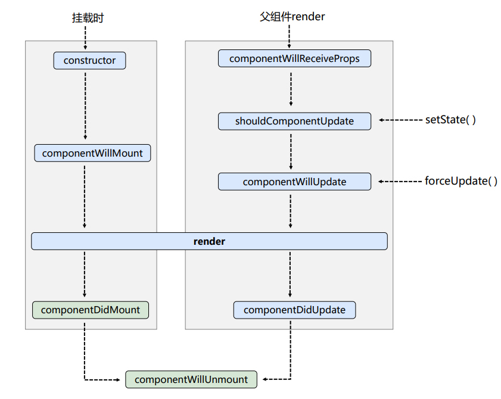
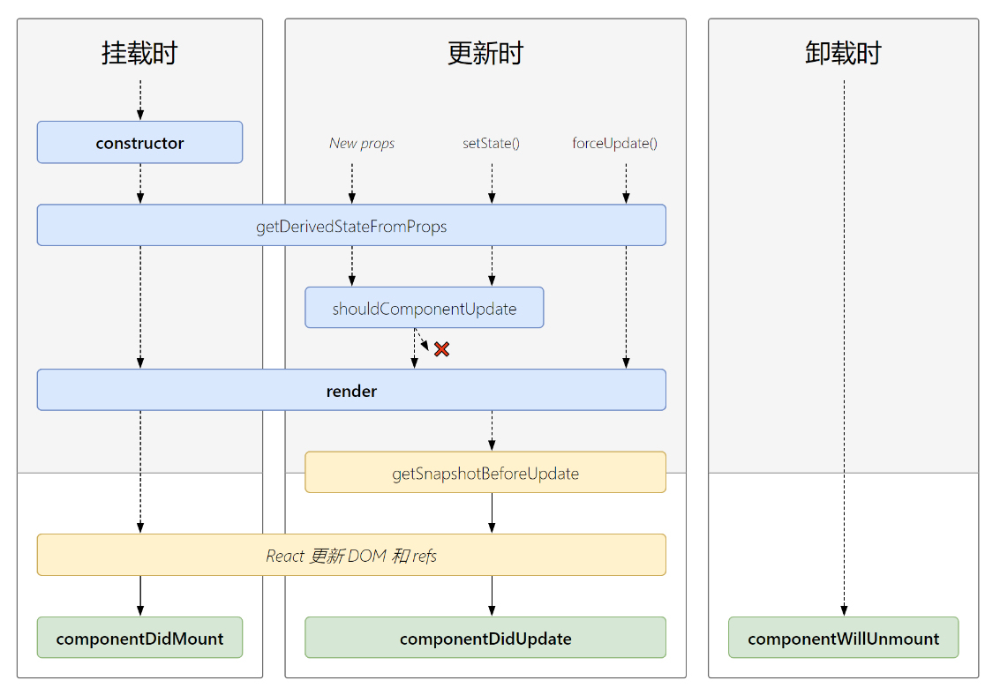

<a name="E6pqc"></a>

# 组件和基础

<a name="baapk"></a>

##### 组件的生成方式

```javascript
import React, { Component } from "react";
//组件名首字母大写
//类生成方式
class Header extends Component {
  render() {
    return <div>微博头部</div>;
  }
}
//函数组件：没有生命周期，不能定义自己的状态（）
//ES5生成方式
function Main() {
  return <main>微博的内容</main>;
}
//ES6生成方式
const Footer = () => {
  return <footer>微博底部</footer>;
};

class App extends Component {
  render() {
    return (
      <>
        {/* Fragment是一个空的占位标签 */}
        <Header />
        <Main />
        <Footer />
      </>
    );
  }
}

export default App;
```

<a name="rIGiR"></a>

##### 受控组件

```javascript
//内容可以由我们自己来控制的组件，必须要有value和onChange
class App extends Component {
  state = {
    valueText: 1
  }
  handleChange = (e) => {
    this.setState({
      valueText: e.target.value,    //输入的值
    });
  }
  handleClick = () => {
    console.log(this.state.valueText);
  }
  render() {
    return (
      <>
        <input
          type="text"
          value={this.state.valueText}
          onChange={this.handleChange}
        />
        <button onClick={this.handleClick}>btn</button>
      </>
              <p>输入的值是：{this.state.valueText}</p>   //实现双向绑定效果
    );
  }
}

//函数组件 useState
 const setUserName = (e) => {
        setUserRealName(e.target.value)
    }
```

<a name="GTV8r"></a>

##### 非受控组件

```javascript
//解构createRef，创建Refs并通过ref属性联系到React组件。Refs通常当组件被创建时被分配给实例变量，这样它们就能在组件中被引用。
import React, { Component, createRef } from "react";
class App extends Component {
  num = createRef(); //current 属性是唯一可用的属性
  handleClick2 = (ipt) => {
    console.log(this.num.current.value);
  };
  render() {
    return (
      <>
        <input type="text" ref={this.num} />
        <button onClick={this.handleClick2}>btn</button>
      </>
    );
  }
}
```

<a name="qXXwP"></a>

##### 样式和类

```javascript
1、组件中的内联样式
class Header extends React.Component {
  render() {
    return (<header style={{color:"red"}}>这是头</header>)    //外层{}为jsx语法，内层{}为对象写法
  }
}

2、直接导入css
import "XXX.css";     //导入定义过的css文件
const Main = ()=>{
  return (<main className="orange big">这是身体</main>)      //class为关键字，必须使用className
}

3、不同的条件添加不同的样式-使用classnames这个包
//下载安装classnames包
$npm i classnames
//引入classnames包
import classNames from "classNames/bind"
//引入CSS文件
import styles from './classNames.css'
let cx = classNames.bind(styles);

function Footer() {
  let className = cx({
    blue: true,
    red: false
  }) ;
  return <footer className={className}>这是脚</footer>;
}

4、在js中写css改变样式
//安装包
$npm i styled-components
//新建含有css的js文件，导入模块并导出样式
import styled from "styled-components";
const Pstyled = styled.h1`                      //h1为标签名，后面接模板字符串
  color: red;
  font-size: ${(props) => props.size + "px"}; `;  //可以通过props传值
export { Pstyled };
//组件中使用
import React, { Component } from "react";
import { Pstyled } from "./scc-in-js.js";

class App extends Component {
  render() {
    return (
      <>
        <Pstyled size="60">styled-components</Pstyled>
      </>
    );
  }
}
export default App;
```

<a name="hS81L"></a>

##### state-状态

```javascript
1、通过申明式地定义state
class App extends Component {
  state = {
    num: 10,
  }
  render() {
    const { num } = this.state;     //解构state中的num
    return (
      <><h1>
        num - {num}
      </h1></>
    )
  }
}
2、通过构造函数的构造器constructor来定义state,当我们去实例化这个类的时候，它是会自动执行的
class App extends Component {
  constructor() {
     // 用于继承父类，只有调用过super之后才能使用this
    super();
    this.state = {
      num: 10,
    }
  }
  render() {
    return (
      <>
        <p>
          num - {this.state.num}
        </p>
      </>
    )
  }
}

! setState在合成事件是异步的
! setState在生命周期里是异步的
! setState在定时器里面是同步的
! setState在原生js里面是同步的

//setState有两种写法
//第一种是里面写对象,允许setState传第二个参数，是回调函数
    this.setState(               //需要修正this的指向
      {
        count: 10,
      },
      () => {
        console.log(this.state.count);
      }
    );

//第二种方式是里面写函数, 可以接收一个参数(任意形参)，表示前一次的state,允许setState传第二个参数，是回调函数
    this.setState(                                  //需要修正this的指向
      (prevState) => {
        return {
            list: prevState.list.concat(item),      //list: [...prevState.list, item],
        };
      },
      () => {
        console.log(this.state.item);
      }
    );
```

<a name="esUhi"></a>

##### Portal（改变元素在 DOM 结构中的位置）

```javascript
//解构
import { createPortal } from "react-dom";
//应用
class App extends Component {
  render() {
    return (
      <div>
        <h3>portal</h3>
        {createPortal(<Child />, document.querySelector("html"))} //函数，传入两个参数，第一个为组件，第二个为位置
      </div>
    );
  }
}
```

<a name="GKrUw"></a>

# 类组件生命周期

<a name="bMJgU"></a>

##### React 组件的生命周期分为三个阶段：挂载阶段、更新阶段和卸载阶段

```javascript
挂载阶段包括以下方法：

- constructor：组件被创建时调用，用于初始化状态和绑定事件处理函数。
- getDerivedStateFromProps：在组件挂载之前和更新时调用，用于根据props更新state。
- render：根据props和state渲染组件。
- componentDidMount：组件挂载后调用，用于进行异步操作和DOM操作。

更新阶段包括以下方法：

- getDerivedStateFromProps：在组件更新时调用，用于根据props更新state。
- shouldComponentUpdate：在组件更新前调用，用于判断是否需要重新渲染组件。
- render：根据props和state渲染组件。
- componentDidUpdate：在组件更新后调用，用于进行异步操作和DOM操作。

卸载阶段包括以下方法：

- componentWillUnmount：在组件卸载前调用，用于清理定时器、取消订阅等操作。
```

<a name="IZk88"></a>

## 类组件的生命周期-旧版


<a name="q19yC"></a>

##### 初始化

```javascript
  // 当这个类被实例化的时候就会自动执行，最先执行，并且只执行一次
  constructor(props) {               // 当props的值需要作为state的初始值的时候
    super(props);                    //super必须写在最前面
    this.state = {
      count: 10,
    };
    this.ipt = createRef();         //非受控组件传值
  }
```

<a name="v6vJO"></a>

##### 挂载阶段

```javascript
 // componentWillMount是被废弃了, 改名成了UNSAFE_componentWillMount
  UNSAFE_componentWillMount() {
    console.log("componentWillMount");
    // componentWillMount不能做数据请求
    // 因为fiber算法的原因,可能导致这个生命周期被执行多次
  }

  // render本身就是一个生命周期,每次数据改变都重新渲染
  render() {
    console.log("render");
    return (
      <>
        <h3>老版生命周期</h3>
        <p>count: {this.state.count}</p>
      </>
    );
  }

  // 组件挂载完成之后
  componentDidMount() {
    console.log("componentDidMount");
    this.setState({
      count: 20,
    });
  }
```

<a name="rAgpX"></a>

##### 更新阶段

```javascript
// 被废弃了, 因为现在由更好的生命周期来代替
// 当父组件传递的自定义属性发生改变时就会触发
  UNSAFE_componentWillReceiveProps(nextProps) {
    console.log(nextProps);
  }

//决定子组件是否重新渲染
// 必须要返回true或者false, 通过返回true或者false来控制是否要重新渲染当前组件
// 可以接收两个参数，新的props和新的state，旧的还是this.props.xxx
// PureComponent 纯组件   用于代替Component
shouldComponentUpdate(nextProps, nextState) {
    return nextState.count !== this.state.count;
  }

// 被弃用
  UNSAFE_componentWillUpdate() {
    console.log("componentWillUpdate");
  }

// 更新结束
// 不能在这里更新数据
  componentDidUpdate() {
    console.log("componentDidUpdate");
  }
```

<a name="Zvr9S"></a>

##### 卸载阶段

```javascript
//组件将要销毁
componentWillUnmount() {
    // 定时器，事件监听，websocket, 插件等
    console.log("componentWillUnmount");
  }
```

<a name="GfG72"></a>

## 类组件的生命周期-新版


<a name="augfs"></a>

##### getDerivedStateFromProps

```javascript
// 根据props的值去获取一个新的state
// 它前面要有一个static关键字
// 必须要return 对象或者null  如果null表示啥也不做，如果是对象就会合并之前的state
```

<a name="YjOay"></a>

##### getSnapshotBeforeUpdate

```javascript
// 生成一个快照在更新之前
// 拿到更新前的状态给更新以后用
  getSnapshotBeforeUpdate(prevProps, prevState) {
    // 快照就是某一条记录或者某一个值，return出来被销毁周期接收
    return prevState;
  }

// componentDidUpdate第三个参数就是getSnapshotBeforeUpdate里面return的那个值
  componentDidUpdate(prevProps, prevState, snapshot) {
    console.log(snapshot);
  }
```

<a name="Llgkg"></a>

# 传参与通信

<a name="Fi4wO"></a>

##### props 传值检测

```javascript
//安装包prop-types
$ npm i prop-types -S
//解构
import { number, string } from "prop-types";
//类组件检测
class Child extends Component {
  static propTypes = {
    count: number,
    msg: string,
  };
  render() {
    return <div>child - {this.props.count}</div>;
  }
}
//函数组件检测
const Child = (props) => {
  return <div>child - {props.count}</div>;
};
Child.propTypes = {
  count: number,
  msg: string,
};
```

<a name="EHG8m"></a>

##### 父组件向子组件通信：使用 props

```javascript
父组件 App.js：
import React,{ Component } from "react";
import Sub from "./SubComponent.js";
import "./App.css";
export default class App extends Component{
    render(){
        return(
            <div>
                <Sub title = "今年过节不收礼" />
            </div>
        )
    }
}

子组件 SubComponent.js：
import React from "react";
const Sub = (props) => {
    return(
        <h1>
            { props.title }
        </h1>
    )
}

export default Sub;
```

<a name="hlR2Z"></a>

##### 子组件向父组件通信：使用 props 回调

```javascript
SubComponent.js代码：
import React from "react";
const Sub = (props) => {
    const cb = (msg) => {
        return () => {
            props.callback(msg)
        }
    }
    return(
        <div>
            <button onClick = { cb("我们通信吧") }>点击我</button>
        </div>
    )
}
export default Sub;

App.js代码：
import React,{ Component } from "react";
import Sub from "./SubComponent.js";
import "./App.css";
export default class App extends Component{
    callback(msg){
        console.log(msg);
    }
    render(){
        return(
            <div>
                <Sub callback = { this.callback.bind(this) } />
            </div>
        )
    }
}
```

<a name="cAbDG"></a>

##### 兄弟间的传参

```javascript
1：子组件1中的事件去触发定义在父组件中的自定义事件，并传入子组件中的变量
class Child1 extends Component {
  state = {
    count: 10,
  }
  change = () => {                                               //去触发父组件中定义的事件
    this.props.onchange(this.state.count)
  }
  render() {
    return (
      <>
        <div>{this.state.count}</div>
        <button onClick={this.change}>按钮</button>
      </>
    );
  }
}

2：父组件被子组件1的事件触发自己定义的事件，改变自己组件中的变量的值
class App extends React.Component {
  state = { count: 5 }
  Change = (count) => {
    this.setState({ count: count })
  }
  render() {
    return (
      <>
        <Child1 onchange={this.Change}></Child1>                 //上面的onchange为此处的事件
        <p>****************************************************************</p>
        <Child2 count={this.state.count}></Child2>
      </>
    )
  }
}

3：子组件2用props去接收数据
//函数组件
const Child2 = (props) => {
  return <p>{props.count}</p>
}
//类组件
class Done extends Component {
  render() {
    return (
      <>
        <p>{this.props.msg}</p>       //接收props数据
      </>
    );
  }
}
```

<a name="sGIJu"></a>

##### 跨级组件间通信：使用 context 对象

```javascript
App.js代码：
import React, { Component } from 'react';
import PropTypes from "prop-types";
import Sub from "./Sub";
import "./App.css";
export default class App extends Component{
    // 父组件声明自己支持 context
    static childContextTypes = {
        color:PropTypes.string,
        callback:PropTypes.func,
    }
    // 父组件提供一个函数，用来返回相应的 context 对象
    getChildContext(){
        return{
            color:"red",
            callback:this.callback.bind(this)
        }
    }
    callback(msg){
        console.log(msg)
    }
    render(){
        return(
            <div>
                <Sub></Sub>
            </div>
        );
    }
}

Sub.js代码：
import React from "react";
import SubSub from "./SubSub";

const Sub = (props) =>{
    return(
        <div>
            <SubSub />
        </div>
    );
}
export default Sub;

SubSub.js代码：
import React,{ Component } from "react";
import PropTypes from "prop-types";
export default class SubSub extends Component{
    // 子组件声明自己需要使用 context
    static contextTypes = {
        color:PropTypes.string,
        callback:PropTypes.func,
    }
    render(){
        const style = { color:this.context.color }
        const cb = (msg) => {
            return () => {
                this.context.callback(msg);
            }
        }
        return(
            <div style = { style }>
                SUBSUB
                <button onClick = { cb("我胡汉三又回来了！") }>点击我</button>
            </div>
        );
    }
}

//解构出 createContext 函数
import React, { Component, createContext } from "react";
// Provider提供者，依赖
// Consumer消费者，注入
const { Provider, Consumer } = createContext();

//用Provider标签包裹父组件，Provider还必须要由一个属性value用来传参，可以传变量或者函数
render() {
    return (
      <Provider value={{ num: this.state.num }}>
        <p>这是父组件</p>
        <Child1 />
      </Provider>
    );
  }

//子组件用Consumer去接收，里面写一个函数，参数为Value
     <Consumer>
          {(value) => (
            <>
              <button onClick={value.fn1}>-</button>
              <span>{value.num}</span>
              <button onClick={value.fn2}>+</button>
            </>
          )}
    </Consumer>
```

<a name="BDxSB"></a>

##### 父组件调用子组件的方法

```javascript
在 React 中，可以使用 `ref` 来获取子组件的实例，并调用其方法。下面是一个示例：假设有一个子组件 `Child`，其中有一个 `handleClick` 方法：

class Child extends React.Component {
  handleClick() {
    console.log('Child clicked')
  }

  render() {
    return <button onClick={this.handleClick}>Child button</button>
  }
}

现在我们想要在父组件中调用 `Child` 组件的 `handleClick` 方法。我们可以在父组件中创建一个 `ref`，在 `Child` 组件上引用这个 `ref`，然后就可以在父组件中调用 `Child` 组件的 `handleClick` 方法了。

class Parent extends React.Component {
  childRef = React.createRef()

  handleClick() {
    this.childRef.current.handleClick()
  }

  render() {
    return (
      <div>
        <Child ref={this.childRef} />
        <button onClick={() => this.handleClick()}>Call child method</button>
      </div>
    )
  }
}

在上面的代码中，我们首先创建了一个 `childRef`，然后在 `Child` 组件上引用这个 `ref`。在父组件中，我们创建了一个 `handleClick` 方法，该方法通过 `childRef.current.handleClick()` 调用了 `Child` 组件的 `handleClick` 方法。最后，我们在父组件中渲染了一个按钮，当点击这个按钮时，会调用 `handleClick` 方法，从而触发 `Child` 组件的 `handleClick` 方法。

需要注意的是，只有在 `Child` 组件挂载到 DOM 中后，`childRef.current` 才会有值，因此要确保在调用 `handleClick` 方法之前 `Child` 组件已经挂载到了 DOM 中。
```

<a name="GBihK"></a>

# 全局状态管理 Redux

<a name="XaLlD"></a>

##### 依赖安装

```javascript
yarn add redux react-redux redux-actions --save -D
```

<a name="LWSSG"></a>

##### 创建 reducers

```javascript
// 子reduce.js文件
import { handleActions } from "redux-actions";

const initialState = {
  match: {
    status: true,
  },
  count: 1,
};
export default handleActions(
  {
    UPDATE_MATCH(state, action) {
      return Object.assign({}, state, action.payload);
    },
    UPDATE_COUNT(state, action) {
      return Object.assign({}, state, action.payload);
    },
  },
  initialState
);

// 使用index.js文件，聚合所有文件夹的reduce
import { combineReducers } from "redux";
import root from "./root";

const rootReducer = combineReducers({
  root,
});

export default rootReducer;
```

<a name="tsU7E"></a>

##### 创建 actions

```javascript
import { createAction } from "redux-actions";

export const updateMatch = createAction("UPDATE_MATCH");

export const updateCount = createAction("UPDATE_COUNT");
```

<a name="yUQkp"></a>

##### 创建 store

```javascript
// src/store/index.js
import { createStore, applyMiddleware } from "redux";
import { routerMiddleware } from "react-router-redux";
import thunkMiddleware from "redux-thunk";
import logger from "redux-logger"; // 日志
import rootReducer from "../reducers";

const routeMiddleware = routerMiddleware();

let createStoreWithMiddleware;
if (process.env.NODE_ENV !== "production") {
  createStoreWithMiddleware = applyMiddleware(
    thunkMiddleware,
    routeMiddleware,
    logger
  )(createStore);
} else {
  createStoreWithMiddleware = applyMiddleware(
    thunkMiddleware,
    routeMiddleware
  )(createStore);
}

const store = createStoreWithMiddleware(rootReducer);

export default store;
```

<a name="OGKD6"></a>

##### 穿透整个项目文件

```javascript
import React, { Suspense } from "react";
import ReactDOM from "react-dom/client";
import { Router, Switch, Redirect, Route } from "react-router-dom";
import history from "./utils/history";
import routes from "./router/config";
import { Provider } from "react-redux";
import store from "@store/configureStore";

const root = ReactDOM.createRoot(document.getElementById("app"));
root.render(
  <Provider store={store}>
    <Router history={history}>
      <Suspense fallback={<div>loading...</div>}>
        <Switch>
          {routes.map((item, index) => {
            return (
              <Route key={index} path={item.path} component={item.component} />
            );
          })}
          <Redirect from="/*" to="/" />
        </Switch>
      </Suspense>
    </Router>
  </Provider>
);
```

<a name="uW2M1"></a>

##### 项目文件使用

```javascript
import { useSelector, useDispatch } from "react-redux";
import { updateCount } from "@actions/root";

const Index = () => {
  const dispatch = useDispatch();
  const data = useSelector((state) => state);

  const handleClick = () => {
    dispatch(updateCount({ count: 2 }));
    // console.log(data);
  };

  return (
    <div className="about">
      <button onClick={() => handleClick()}>改变数据</button>
    </div>
  );
};

export default Index;
```

<a name="q8Kdm"></a>

## redux 异步操作

<a name="gzYPk"></a>

##### 异步操作- redux-thunk 库

```javascript
//action必须是扁平化对象
1、安装redux-thunk库，并且在reducer的index文件中解构applyMiddleware
    $yarn add redux-thunk
// applyMiddleware表示中间件
    import { createStore, applyMiddleware } from "redux";
//引入redux-thunk
    import thunk from "redux-thunk";
// applyMiddleware执行的时候要接收一个参数, 里面接收redux的异步库
    const store = createStore(reducer, applyMiddleware(thunk));

2、创建一个异步函数去调用同步函数，改变数据
    export const loadAsyncAction = () => {
      // redux-thunk异步库允许我们在这里return函数， 并且可以接收dispatch接收参数
      // 而且这个函数会自动执行
      return (dispatch) => {
        // 数据请求
        fetch(
          "https://www.fastmock.site/mock/918b096c85edca5de807f1f8398af51e/api/list"
        )
          .then((response) => response.json())
          .then((res) => {
            dispatch(loadAction(res.list));
          });
      };
    };
    const loadAction = (payload) => {
      return {
        type: "load",
        payload: payload,
       };
    };
```

<a name="XmDhe"></a>

# React Router（默认是 history 模式）

<a name="V0VjA"></a>

##### 基础路由

```javascript
1、安装react-router-dom
$yarn add react-router-dom
2、从react-router-dom中解构 BrowserRouter,Link,Route,Switch
// 如果我们的项目要使用路由，要在整个项目的最外面套一个BrowserRouter组件
//实现地址变化使用Link组件
//Route要匹配渲染，path属性和component属性
//react的路由默认是包容性路由，使用exact属性(精准匹配)或者Switch组件是将路由变成排他性路由, 分支匹配
    import React, { Component } from "react";
    import { BrowserRouter, Link, Route, Switch } from "react-router-dom";

    const Home = () => <div>home</div>;
    const About = () => <div>About</div>;
    const Topics = () => <div>Topics</div>;

    class App extends Component {
      state = {};
      render() {
        return (
          <BrowserRouter>
            <h1>你好--路由</h1>
            <ul>
              <li>
                <Link to="/home">home</Link>
              </li>
              <li>
                <Link to="/about"> about</Link>
              </li>
              <li>
                <Link to="topics">topics</Link>
              </li>
            </ul>
            <Switch>
              <Route path="/home" component={Home}></Route>
              <Route path="/about" component={About}></Route>
              <Route path="/topics" component={Topics}></Route>
            </Switch>
          </BrowserRouter>
        );
      }
    }

    export default App;
```

<a name="TvK9f"></a>

##### 嵌套路由

```javascript
//引入模块
import React, { Component } from "react";
import { BrowserRouter, Link, Route, Switch } from "react-router-dom";
//根路由
class App extends Component {
  render() {
    return (
      <BrowserRouter>
        <h1>路由嵌套</h1>
        <ul>
          <li>
            <Link to="/home">home</Link>
          </li>
          <li>
            <Link to="/about">about</Link>
          </li>
          <li>
            <Link to="/topics">Topics</Link>
          </li>
        </ul>
        <Switch>
          <Route path="/home" component={Home} />
          <Route path="/about" component={About} />
          <Route path="/topics" component={Topics} />
        </Switch>
      </BrowserRouter>
    );
  }
}

export default App;

//一级路由
const About = () => {
  return <div>about</div>;
};
const Topics = () => {
  return <div>topics</div>;
};

//嵌套子路由
const HomeFirst = () => <div>home-first</div>;
const HomeSec = () => <div>home-sec</div>;
const HomeThree = () => <div>home-three</div>;
//嵌套路由
const Home = () => {
  return (
    <div>
      <h1>home</h1>

      <ul>
        <li>
          <Link to="/home/home-first">home-first</Link>
        </li>
        <li>
          <Link to="/home/home-sec">home-sec</Link>
        </li>
        <li>
          <Link to="/home/home-three">home-three</Link>
        </li>
      </ul>
      <Switch>
        <Route path="/home/home-first" component={HomeFirst} />
        <Route path="/home/home-sec" component={HomeSec} />
        <Route path="/home/home-three" component={HomeThree} />
      </Switch>
    </div>
  );
};
```

<a name="xgnvm"></a>

##### 动态参数

```javascript
import React, { Component } from "react";
import { BrowserRouter, Link, Route, Switch } from "react-router-dom";

const Home = () => <div>home</div>;
const Topics = (props) => {
  //获取传过来的id： props.match.params.id
  return <div> topics-id :{props.match.params.id} </div>;
};

class App extends Component {
  state = {};
  render() {
    return (
      <BrowserRouter>
        <h1>你好--动态路由</h1>
        <ul>
          <li>
            <Link to="/home">home</Link>
          </li>
          <li>
            <Link to="/topics/1">Topics1</Link>
          </li>
          <li>
            <Link to="/topics/2">Topics2</Link>
          </li>
        </ul>
        <Switch>
          <Route path="/home" component={Home}></Route>
          <Route path="/topics/:id" component={Topics}></Route>
        </Switch>
      </BrowserRouter>
    );
  }
}
```

<a name="YL8vq"></a>

##### 路由渲染

```javascript
//在Route里面要渲染组件，要用component属性
//除了component属性,还可以用render属性来渲染组件;render只能渲染函数组件不能渲染类组件、不能直接获取路由信息；
//改写并获得路由信息：
<Route path="/home" render={(props) => <Home {...props} />}></Route>
//还可以用chilren属性去渲染;children属性也只能渲染函数组件;不管path是否匹配都渲染, 一般会和Switch一起使用
//还可以将组件直接写在Route组件的中间而不使用component属性;这种写法拿不到路由信息
```

<a name="BNYHh"></a>

##### 路由重定向

```javascript
//解构 Redirect 组件
//搭配switch组件使用exact属性精准匹配
<Switch>
  <Redirect from="/" to="/home" exact></Redirect>
</Switch>
```

<a name="AdhAT"></a>

##### 路由鉴权

```javascript
//在Route组件中，使用render渲染函数组件，返回结果前进行判断，如果不满足条件则使用重定向(Redirect)另一个页面
<Switch>
  <Route path="/userCenter"
  	render={() => { localStorage.getItem("token") ？<userCenter /> ：<Redirect to="/login"> </Redirect> } ></Route>  // 鉴权
  <Route path="/login" component={Login}></Route>
  <Route path="*" component={NotFound}></Route>   //404路由，使用的时候配合Switch组件，并且写在最后
</Switch>
```

<a name="eTunv"></a>

##### Navlink 标签

```javascript
//Navlink也是用来做路由跳转的，可以完全取代 link ，比link多了个css高亮的效果，默认类名为active
//解构Navlink组件
    import {  NavLink } from "react-router-dom";
//使用的时候需要精准匹配
    <li><NavLink to="/home" exact >home</NavLink></li>
//使用activeClassName属性修改默认类名
   <li><NavLink to="/home" exact activeClassName = "abc" >home</NavLink></li>
//使用activeStyle属性修改选中时样式
   <li><NavLink to="/home" exact activeStyle = {{color : red }} >home</NavLink></li>
```

<a name="JJ6qz"></a>

##### 路由传参

```javascript
1、动态参数
// props.match.params.id

2、url传参
    <Link to="/topics/2" search:"?a=3&b=4" >About</Link>
//使用H5自带的URLSearchParams中的get()方法去匹配取出参数
    const About = (props) => {
      const {
        location: { search },
      } = props;
      const a = new URLSearchParams(search);
      console.log(a.get("a"));
      return <div>about</div>;
    };

3、state传参
    <Link to="/topics/2" state:{msg:"hello"} >Topics2</Link>
//在该传参的组件中打印 props.location 获取参数
    const Topics = (props) => {
      console.log(props.location);
      return <div>Topics</div>;
    };
```

<a name="ORHSM"></a>

# 懒加载 Lazy

<a name="hTARF"></a>

##### import 函数

```javascript
//import 命令
import { add } from "./math";
console.log(add(16, 26));

//import函数
import("./math").then((math) => {
  console.log(math.add(16, 26));
});
```

<a name="aqNBf"></a>

##### lazy 函数和 Suspense 组件-组件中的使用

```javascript
1、解构lazy、Suspense
    import { lazy, Suspense } from "react";
2、使用lazy配合import引入组件
    const Child = lazy(() => import("./Child"));
3、使用Supense包裹元素，切Supense中还有个属性 fallback ，里面写一个加载过程中显示内容的组件
    <Suspense fallback={<div>loading...</div>}>
      {this.state.isShow && <Child />}
    </Suspense>
```

<a name="DWHxh"></a>

##### lazy 函数和 Suspense 组件-路由中的使用

```javascript
const Home = lazy(() => import("./Home"));
const About = lazy(() => import("./About"));

class App extends Component {
  render() {
    return (
      <BrowserRouter>
        <ul>
          <li>
            <Link to="/home">home</Link>
          </li>
          <li>
            <Link to="/about">about</Link>
          </li>
        </ul>
        <Suspense fallback={<div>loading...</div>}>
          <Switch>
            <Route path="/home" component={Home}></Route>
            <Route path="/about" component={About}></Route>
          </Switch>
        </Suspense>
      </BrowserRouter>
    );
  }
}
```

<a name="Kfxci"></a>

# 装饰器

```javascript
1、下载安装依赖
yarn add @babel/core @babel/plugin-proposal-decorators @babel/preset-env

2、创建 .babelrc
{
  "presets": [
    "@babel/preset-env"
  ],
    "plugins": [
      [
        "@babel/plugin-proposal-decorators",
        {
          "legacy": true
        }
      ]
    ]
}

3、创建config-overrides.js
const path = require('path')
const { override, addDecoratorsLegacy } = require('customize-cra')

function resolve(dir) {
  return path.join(__dirname, dir)
}

const customize = () => (config, env) => {
  config.resolve.alias['@'] = resolve('src')
  if (env === 'production') {
    config.externals = {
      'react': 'React',
      'react-dom': 'ReactDOM'
    }
  }

  return config
};
module.exports = override(addDecoratorsLegacy(), customize())

4、安装依赖
yarn add customize-cra react-app-rewired

5、修改package.json
  ...
  "scripts": {
    "start": "react-app-rewired start",
      "build": "react-app-rewired build",
        "test": "react-app-rewired test",
          "eject": "react-app-rewired eject"
  },
    ...

    6、使用withRoute
    import { withRouter } from "react-router-dom";
//在需要获得路由信息的组件前使用
    @withRoute
```

<a name="yk5Fn"></a>

## 移动端适配

```javascript
1、在config-overrides.js中的customize-cra去配置，customize-cra是一个NPM包，用来做webpack的配置；
2、下载插件 postcss-px2rem
3、修改config-overrides.js文件(新增以下内容)
    const {addPostcssPlugins } = require("customize-cra");
    module.exports = override(
      addPostcssPlugins([require("postcss-px2rem")({ remUnit: 37.5 })])
    );
```

<a name="A5dUR"></a>

# HOC 高阶组件

```javascript
// 高阶组件=>函数， 传入一个组件(函数组件、类组件)，返回一个新组件
// 作用： 增强组件的功能，复用
//封装一个高阶组件js文件
const withHoc = (Comp) => {
  return class extends Component {
    render() {
      console.log(this.props);
      return (
        <>
          <Comp msg="hello" {...this.props} /> //展开合并原有属性
        </>
      );
    }
  };
};

//在其他组件中使用
export default withHoc(App);
```

<a name="rgtE3"></a>

# 核心设计（Virtual DOM 和 Diff 算法）

<a name="GawsM"></a>

##### React 虚拟 DOM（Virtual DOM）

```html
React提出的一种解决方案，它是一个轻量级的JavaScript对象，用来描述真实DOM的结构和属性。React通过比较虚拟DOM的差异，计算出需要更新的部分，然后再将这些部分更新到真实DOM上。React虚拟DOM的原理是：
1. 首先，React将组件的状态和属性传入组件的render方法，得到一个虚拟DOM树。 2.
当组件的状态或属性发生变化时，React会再次调用render方法得到新的虚拟DOM树。 3.
React会将新旧两棵虚拟DOM树进行比较，得到它们的不同之处。 4.
React会将这些不同之处记录下来，然后批量的更新到真实的DOM树上。
React通过虚拟DOM树的比较，避免了直接操作真实DOM树带来的性能问题，因为直接操作真实DOM树会带来大量的重排和重绘，而React的虚拟DOM树的比较和更新是基于JavaScript对象进行的，不会导致页面的重排和重绘。
总结起来，React虚拟DOM的原理就是：通过比较虚拟DOM树的不同，批量的更新真实的DOM树，从而提高页面的性能。
```

<a name="vlrTv"></a>

##### React Diff 算法

```javascript
React Diff是React中用于更新Virtual DOM的算法它的目的是在最小化DOM操作的同时，尽可能快地更新组件。它通过比较Virtual DOM树的前后两个状态来确定哪些部分需要更新。

React Diff算法的核心思想是尽可能地复用已有的DOM节点。当Virtual DOM中的某个节点发生变化时，React会先比较该节点的属性和子节点是否有变化，如果没有变化，则直接复用该节点。如果有变化，则会在该节点的父节点下创建一个新的节点，并将新的属性和子节点赋值给该节点。

React Diff算法的具体实现有两种方式：深度优先遍历和广度优先遍历。深度优先遍历是指先比较父节点的子节点，如果子节点有变化，则递归比较子节点的子节点。广度优先遍历是指先比较同级节点，如果同级节点有变化，则递归比较子节点。

React Diff算法的优化策略包括：key属性的使用、组件的shouldComponentUpdate方法、使用Immutable.js等。其中，key属性的使用是最常用的优化策略，它可以帮助React更准确地判断哪些节点需要更新，从而减少不必要的DOM操作。

React Diff算法具有以下特点：
1. 先判断两个节点是否相等，如果相等，就不需要更新。
2. 如果两个节点类型不同，则直接替换节点。
3. 如果节点类型相同，但是节点属性不同，则更新节点属性。
4. 如果节点类型相同，但是子节点不同，则使用递归的方式进行更新。
React Diff算法的时间复杂度是O(n)，其中n为Virtual DOM树中节点的数量。由于React Diff算法能够避免不必要的DOM操作，因此可以大大提高组件更新的性能。
```
